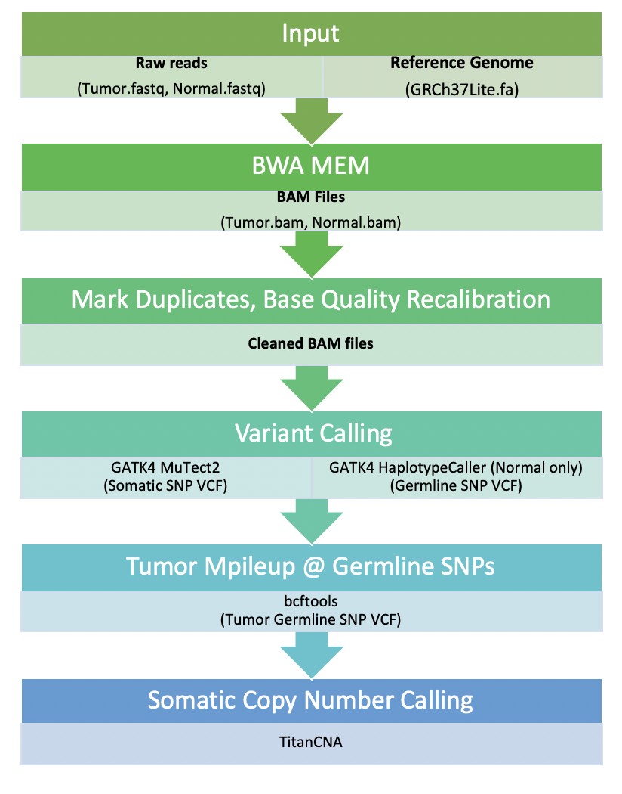

## Introduction





This is a Snakemake pipeline written for the processing of whole-genome sequencing data of matched normal-tumor samples. The pipeline takes as input Illumina FASTQ files and will output:

* Germline SNPs and tumor BAF at these positions (HaplotypeCaller)
* Simple somatic mutations (Mutect2)
* Somatic CNAs (TitanCNA)

The pipeline uses a combination of GATK4 and TitanCNA for calling somatic mutations and copy number alterations.

## Environment

The environment is handled by the `conda` package manager. Use the given `environment.yaml` file to create the environment.

```
conda env create --file environment.yaml
```

Load environment

```
source activate biotools
```

## Running the pipeline

Please edit the `configfig.yaml` and follow the instructions. You will need to add the absolute paths to your project directory, reference genome file (as well as index and dict), as well as information required fir TitanCNA. 

Your working directory should look like:

```
my_project/
└── fastq
    ├── patientID_normal_R1.fastq.gz
    ├── patientID_normal_R2.fastq.gz
    ├── patientID_tumor_R1.fastq.gz
    └── patientID_tumor_R2.fastq.gz
```

#### Command line

After filling out the config file, simply type to run

```
snakemake --configfile configfile.yaml
```

#### SLURM

If running on the cluster, please edit the `cluster.json` config file to match your cluster configuration. Once complete, submit the given sbatch file to the cluster.

```
sbatch snakemake.sbatch
```


